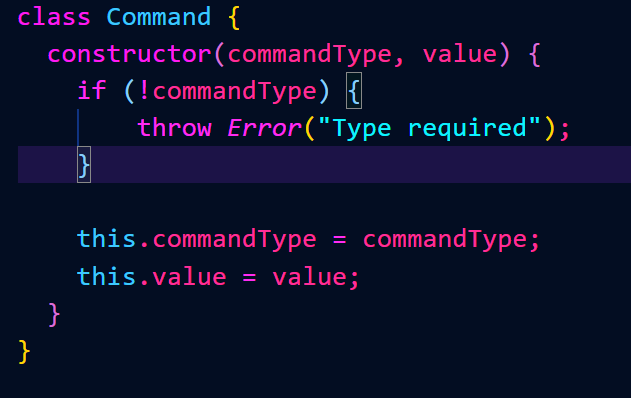
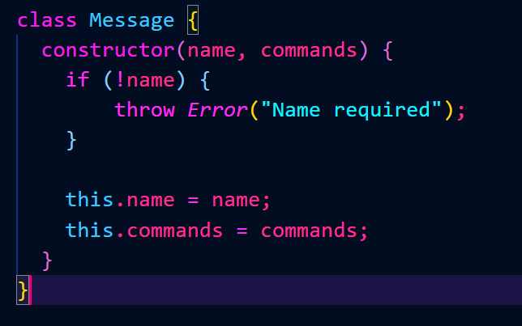

# Mars Rover

A unit testing suite for three classes (themed around a Mars Rover). Built in Node.js using the Jasmine framework.

There are three classes, each of which can be found in the "classes" folder: command.js, message.js, and rover.js. Each class has accompanying unit tests in their respective "spec.js" file located in the "spec" folder. The unit tests can all be run by executing the "runTests.js" script located at the root of this project. 

Below is a walkthrough of the Test Driven Devlopment of the suite(s) and classes.

*This project was a homework assignment from LaunchCode's Lc101 (2019).*

## Define Command Class

## Test Command Class

## Develop Command Class

## Define Message Class

## Test Message Class

## Develop Message Class

## Define Rover Class

## Test Rover

## Develop Rover Class

## Verify Tests Pass

